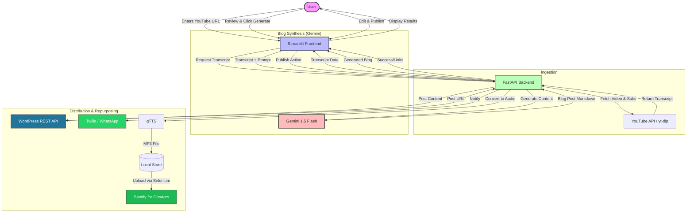

# Project Workflow Diagram

```mermaid
flowchart TD
    User([User]) -->|Enters YouTube URL| Frontend[Streamlit Frontend]
    Frontend -->|Request Transcript| Backend[FastAPI Backend]
    
    subgraph Ingestion
        Backend -->|Fetch Video & Subs| YouTube[YouTube API / yt-dlp]
        YouTube -->|Return Transcript| Backend
    end
    
    Backend -->|Transcript Data| Frontend
    User -->|Review & Click Generate| Frontend
    
    subgraph "Blog Synthesis (Gemini)"
        Frontend -->|Transcript + Prompt| Backend
        Backend -->|Generate Content| Gemini[Gemini 1.5 Flash]
        Gemini -->|Blog Post Markdown| Backend
    end
    
    Backend -->|Generated Blog| Frontend
    User -->|Edit & Publish| Frontend
    
    subgraph "Distribution & Repurposing"
        Frontend -->|Publish Action| Backend
        
        Backend -->|Post Content| WordPress[WordPress REST API]
        WordPress -->|Post URL| Backend
        
        Backend -->|Notify| WhatsApp[Twilio / WhatsApp]
        
        Backend -->|Convert to Audio| TTS[gTTS]
        TTS -->|MP3 File| LocalStorage[(Local Store)]
        LocalStorage -->|Upload via Selenium| Spotify[Spotify for Creators]
    end
    
    Backend -->|Success/Links| Frontend
    Frontend -->|Display Results| User

    style User fill:#f9f,stroke:#333,stroke-width:2px
    style Frontend fill:#bbf,stroke:#333,stroke-width:2px
    style Backend fill:#bfb,stroke:#333,stroke-width:2px
    style Gemini fill:#fbb,stroke:#333,stroke-width:2px
    style Spotify fill:#1DB954,stroke:#333,color:white
    style WordPress fill:#21759b,stroke:#333,color:white
    style WhatsApp fill:#25D366,stroke:#333,color:white
```
